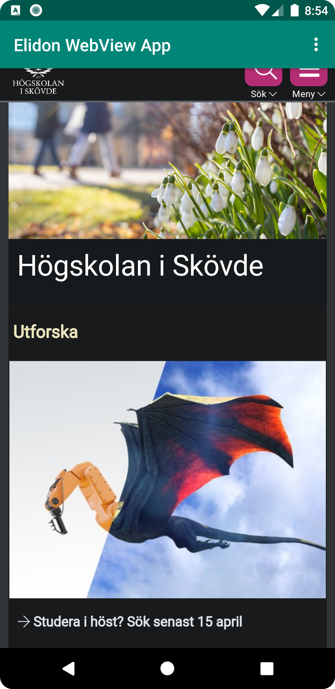
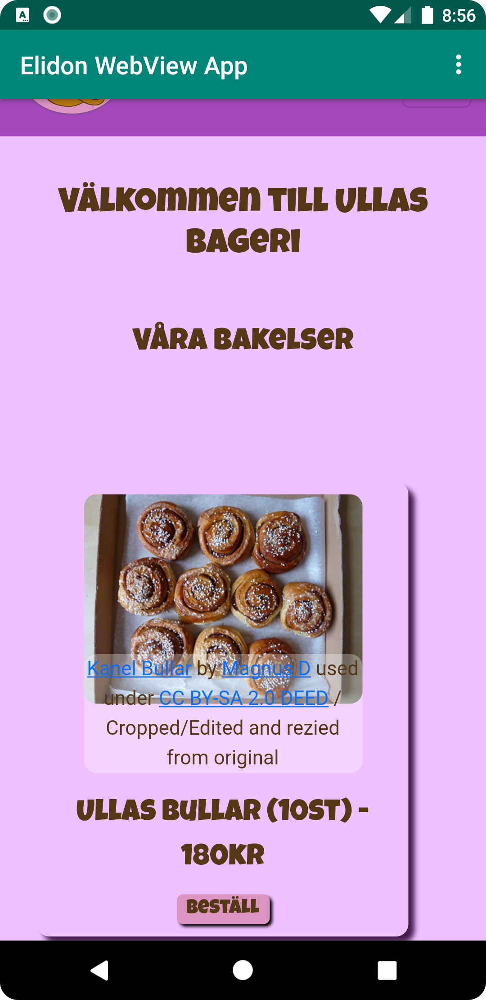

# Rapport

**Skriv din rapport här!**
Skapat app som använder sig utav WebView, appen
använder sig både utav en intern och extern WebView med hjälp
av en toolbar som kör olika funktioner

```
AndroidManifest.xml:
<uses-permission android:name="android.permission.INTERNET" />
```

```
MainActivity.java:
    WebView myWebView;
    public void showExternalWebPage(){
        myWebView.loadUrl("https://his.se");
        // TODO: Add your code for showing external web page here
    }

    public void showInternalWebPage(){
        myWebView.loadUrl("file:///android_asset/index.html");
        // TODO: Add your code for showing internal web page here
    }
    
        myWebView = findViewById(R.id.my_webview);
        myWebView.setWebViewClient(new WebViewClient());
        myWebView.getSettings().setJavaScriptEnabled(true);
```

```
activity_main.xml:
        <WebView
        android:layout_width="match_parent"
        android:layout_height="match_parent"
        android:id="@+id/my_webview"/>
```

Bilder läggs i samma mapp som markdown-filen.

Extern WebView


Intern WebView

